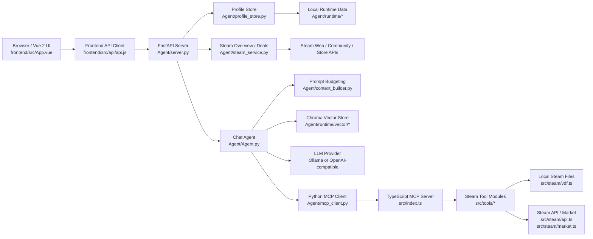
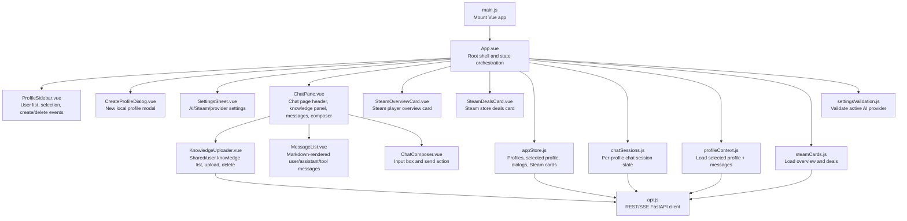
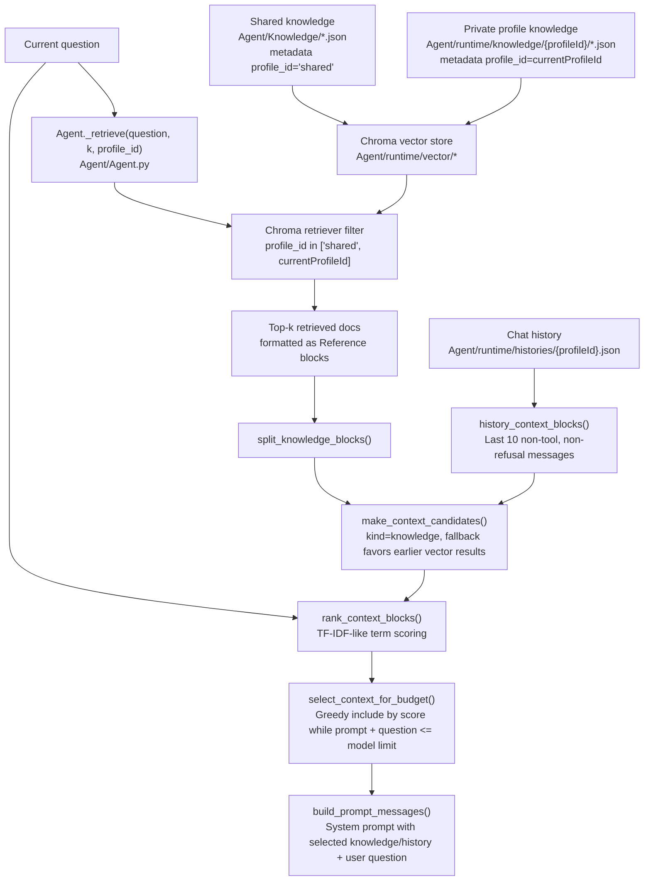
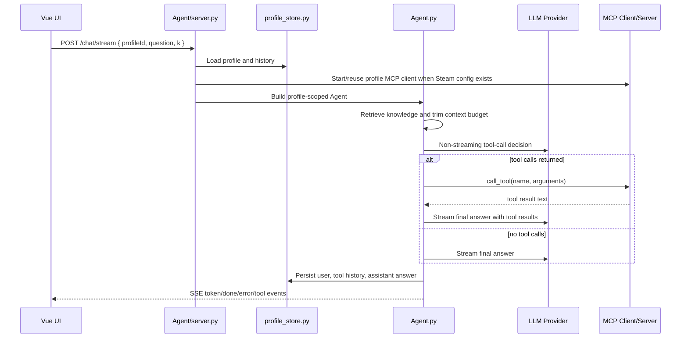
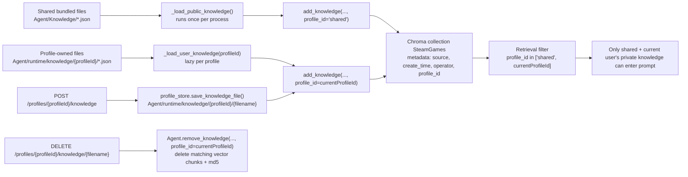
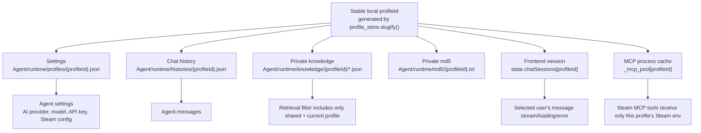

# SteamGenieAgent System Architecture

This document maps the current local dashboard architecture, module responsibilities, and the code files that own each part.

## System Diagram

## Frontend Component Diagram

## RAG And Context Budgeting Flow

The context selector in `Agent/context_builder.py` uses a lightweight TF-IDF-style score instead of a tokenizer-specific dependency:

| Step | Code | Behavior |
|---|---|---|
| Tokenization | `score_tokens()` | Extracts Chinese characters and alphanumeric terms, lowercases terms, drops whitespace. |
| Query weighting | `rank_context_blocks()` | Counts query term frequency with `Counter(score_tokens(question))`. |
| Document frequency | `rank_context_blocks()` | Builds one term set per candidate block and counts in how many blocks each term appears. |
| IDF | `math.log((doc_count + 1) / (document_frequency[term] + 1)) + 1` | Gives rarer matching terms more weight while avoiding divide-by-zero. |
| Candidate score | `query_tf * block_tf * idf + fallback` | Rewards overlap with the question; fallback breaks ties deterministically. |
| Budget selection | `select_context_for_budget()` | Iterates ranked candidates and keeps a block only if the rendered prompt still fits `model_max_token[activeModel]`. |
| Output order | `render_selected_context()` | Restores selected knowledge/history to their original order before inserting them into the prompt. |

## Main Runtime Flow

## Module Map

| Module | Responsibility | Main files |
|---|---|---|
| Vue mount | Boots Vue 2 and mounts the root component. | `frontend/src/main.js` |
| Root shell | Owns three-column layout, selected profile, dialogs, loading/error states, and high-level API orchestration. | `frontend/src/App.vue` |
| Profile sidebar | Lists users, displays provider/status badges, selects users, and emits create/delete actions. | `frontend/src/components/ProfileSidebar.vue` |
| Create profile dialog | Modal for manually creating a local user profile. | `frontend/src/components/CreateProfileDialog.vue` |
| Chat pane | Chat page container; combines settings entry, knowledge uploader, message list, and composer. | `frontend/src/components/ChatPane.vue` |
| Knowledge uploader | Lists shared/private knowledge files, uploads profile-owned JSON, deletes profile-owned files only. | `frontend/src/components/KnowledgeUploader.vue` |
| Message list | Renders user, assistant, tool-call, and tool-result messages with Markdown output. | `frontend/src/components/MessageList.vue` |
| Chat composer | Captures the current user question and emits send events. | `frontend/src/components/ChatComposer.vue` |
| Steam overview card | Displays avatar, persona, online state, current game, owned count, and recent games. | `frontend/src/components/SteamOverviewCard.vue` |
| Steam deals card | Displays store promotion cards for the configured CN/zh-CN defaults. | `frontend/src/components/SteamDealsCard.vue` |
| Settings sheet | Edits per-user AI provider, model, API key, Steam credentials, Steam path, and proxy. | `frontend/src/components/SettingsSheet.vue`, `frontend/src/services/settingsValidation.js` |
| Frontend API client | Wraps REST/SSE calls to FastAPI and prevents accidental direct browser calls to Ollama ports. | `frontend/src/api/api.js` |
| Frontend state helpers | Keeps chat sessions isolated per profile and loads selected profile context. | `frontend/src/store/appStore.js`, `frontend/src/store/chatSessions.js`, `frontend/src/services/profileContext.js` |
| FastAPI app | Exposes profile, config, chat, Steam, and knowledge endpoints; streams chat via SSE. | `Agent/server.py` |
| Profile persistence | Stores local profile JSON, histories, user knowledge files, and md5 sidecars under runtime. | `Agent/profile_store.py` |
| Agent orchestration | Handles retrieval, provider routing, streaming, tool-call loop, fallback filtering, and chat persistence. | `Agent/Agent.py` |
| Prompt budgeting | Converts retrieved knowledge and profile history into candidate blocks, ranks them with TF-IDF-like scoring, and keeps prompts under model limits. | `Agent/context_builder.py` |
| Provider HTTP | Reuses async HTTP clients for JSON, text, and streaming provider/API requests. | `Agent/http_utils.py` |
| Tool markup filtering | Detects and hides provider-specific raw tool-call markup that should not reach users. | `Agent/tool_markup.py` |
| Steam cards | Fetches public/private Steam profile data and store deals with proxy-aware fallbacks. | `Agent/steam_service.py` |
| Python MCP bridge | Starts the TypeScript MCP server as a profile-scoped stdio subprocess and exposes tool schemas to the Agent. | `Agent/mcp_client.py` |
| TypeScript MCP entry | Reads Steam env/config, creates the MCP server, and registers Steam tools. | `src/index.ts` |
| Steam tool modules | Implement library, local install, inventory, market, and social tools. | `src/tools/library.ts`, `src/tools/local.ts`, `src/tools/inventory.ts`, `src/tools/market.ts`, `src/tools/social.ts` |
| Steam adapters | Wrap Steam Web API, market requests, local VDF/library scanning, and game launching. | `src/steam/api.ts`, `src/steam/http.ts`, `src/steam/market.ts`, `src/steam/vdf.ts`, `src/steam/launcher.ts` |

## Shared And Private Knowledge Design

Shared knowledge and private knowledge are separated by both filesystem path and vector metadata:

| Scope | Filesystem | Vector metadata | MD5 markers | Visibility |
|---|---|---|---|---|
| Shared knowledge | `Agent/Knowledge/*.json` | `profile_id='shared'` | `Agent/runtime/md5.txt` | Visible to every profile. |
| Private knowledge | `Agent/runtime/knowledge/{profileId}/*.json` | `profile_id='{profileId}'` | `Agent/runtime/md5/{profileId}.txt` | Visible only to that profile. |

The duplicate check uses both shared and current-profile md5 files, so a user cannot upload private content that duplicates shared knowledge or their own existing private knowledge.

## User Isolation Design

Isolation is enforced in these places:

| Boundary | Code | Isolation rule |
|---|---|---|
| Profile config | `Agent/profile_store.py` | Each user has a separate `profiles/{profileId}.json`; AI and Steam settings are not global. |
| Chat history | `Agent/profile_store.py`, `Agent/Agent.py` | Each user reads/writes `histories/{profileId}.json`; switching profiles reloads that user's context. |
| Frontend live state | `frontend/src/store/chatSessions.js` | Streaming state, errors, messages, and pending assistant reply are keyed by `profileId`. |
| Knowledge files | `Agent/profile_store.py` | Uploads go under `runtime/knowledge/{profileId}`; deleting a profile removes its private knowledge directory. |
| Vector retrieval | `Agent/Agent.py` | Chroma retrieval uses `profile_id in ['shared', currentProfileId]`, never another user's id. |
| MCP tools | `Agent/server.py`, `Agent/mcp_client.py` | MCP subprocesses are cached by `profileId` and receive only that profile's Steam API key, SteamID64, proxy, and Steam path. |
| Delete profile | `ProfileStore.delete_profile()` | Removes profile JSON, history file, private knowledge directory, and private md5 file together. |

## Data and Configuration Boundaries

| Data | Location | Git behavior |
|---|---|---|
| Profile AI/Steam settings | `Agent/runtime/profiles/*.json` | Ignored |
| Chat history | `Agent/runtime/histories/*.json` | Ignored |
| Chroma vectors/sqlite | `Agent/runtime/vector/*` | Ignored |
| Runtime logs/cache | `Agent/runtime/logs/*`, `Agent/runtime/cache/*` | Ignored |
| Shared bundled knowledge | `Agent/Knowledge/*.json` | Tracked |
| Frontend env overrides | `frontend/.env*` | Ignored |

## API Surface

| Endpoint | Purpose |
|---|---|
| `GET /profiles` | Return lightweight profile summaries for the sidebar. |
| `POST /profiles` | Create a new local profile. |
| `GET /profiles/{profileId}` | Return full profile settings. |
| `DELETE /profiles/{profileId}` | Delete profile config, history, knowledge, and md5 sidecars. |
| `PATCH /profiles/{profileId}/config` | Save AI/Steam settings and invalidate cached MCP tools. |
| `GET /profiles/{profileId}/messages` | Return normalized chat history. |
| `POST /chat` | Run a chat turn and return the final answer as JSON. |
| `POST /chat/stream` | Stream chat events through Server-Sent Events. |
| `GET /profiles/{profileId}/steam/overview` | Return Steam profile/status/recent-play overview. |
| `GET /profiles/{profileId}/steam/deals` | Return Steam store card data. |
| `GET /profiles/{profileId}/knowledge` | List shared and profile-owned knowledge files. |
| `POST /profiles/{profileId}/knowledge` | Upload and index profile-owned knowledge JSON. |
| `DELETE /profiles/{profileId}/knowledge/{filename}` | Delete one profile-owned knowledge file and vector/md5 entries. |

## Provider Selection Rules

- Each profile selects exactly one active provider: `ollama` or `openai-compatible`.
- The active provider must have complete settings before save succeeds.
- Inactive provider settings may be empty and are preserved as empty strings.
- The browser should only call FastAPI. LLM provider requests are made by `Agent/Agent.py` on the backend.
- OpenAI-compatible chat calls use `{baseUrl}/chat/completions`.
- Ollama chat calls use `{baseUrl}/api/chat`.
